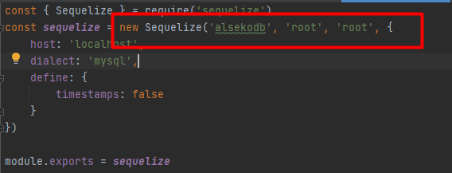

# alseko-test-backend
 
###Чтобы запустить сервер необходимо

* Выполнить команду ```npm i```
* Запустить сервер командой ```npm run dev```

###Инициализация базы данных
Чтобы инициализировать базу данных необходимо выполнить DML и DLL скрипты, они располагаются в корневом каталоге проекта под следующими имена: 

- initDB.sql - создание пустой базы данных ```alsekodb``` и таблиц
- setData.sql - начальное наполнение базы данных

Чтобы выполнить их введите следующие команды

* ```mysql -u <логин> -p < initDB.sql```
* ```mysql -u <логин> -p < setData.sql```

Для подключения к БД используется стандартный логин и пароль root/root, если вы используете другие данные авторизации с mysql, то поменяйте их в файле ```srs/modules/connectionDB.js``` 


